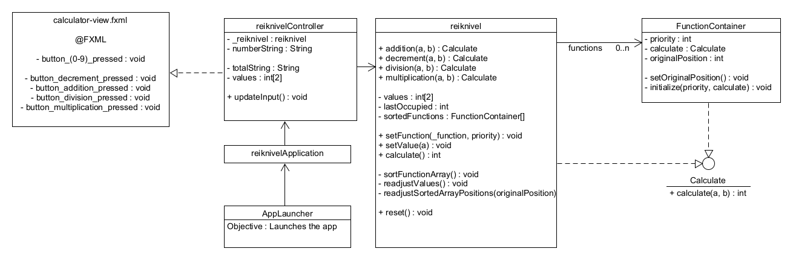

# Design

-'src/main/java/adrian/roszkowski/orell/frontend/reiknivelApplication.java'  
The main function is located in the application, and launches the application.
It starts the Controller which controls the program.

The classes diagram is as follows :
